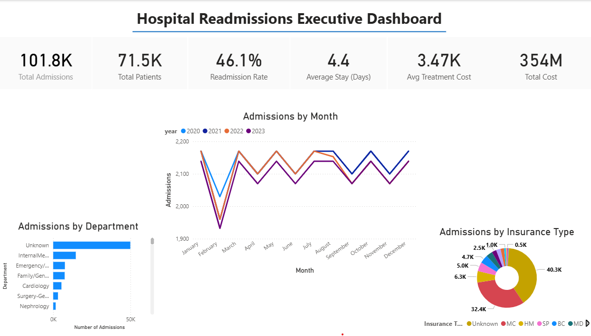

# Executive Healthcare Business Intelligence System

## Hospital Performance Intelligence Dashboard

**Power BI • SQL • Python • DAX**

A production-style healthcare analytics system that transforms hospital operational data into an executive dashboard for monitoring patient admissions, hospital utilization, clinical outcomes, and financial performance.

This project demonstrates how modern analytics engineering practices can be applied to healthcare operations to support data-driven decision making.

---

# Dashboard Preview

Executive overview of hospital admissions trends, departmental demand, and patient demographics.



---

# Key Features

* Executive KPI dashboard for hospital performance
* Multi-page Power BI reporting experience
* SQL-driven analytics queries for operational metrics
* Python preprocessing pipeline for BI-ready datasets
* DAX measures powering healthcare KPIs
* Interactive filtering by department, demographics, and time
* Business-focused data storytelling

---

# Quick Demo


The dashboard enables hospital leadership to:

• Track patient admissions and discharge trends
• Monitor readmission rates across departments
• Analyze patient demographics and insurance types
• Identify high-demand departments
• Evaluate length-of-stay patterns
• Track treatment cost trends

---

# Business Problem

Hospital administrators require clear operational visibility to manage patient flow, improve outcomes, and allocate resources efficiently.

However, healthcare data often exists across multiple operational systems, making it difficult to produce unified analytics.

This project builds an **Executive Healthcare Intelligence System** that consolidates hospital data into a centralized analytics dashboard.

---

# Architecture


Healthcare Dataset
↓
Python Data Preparation
↓
SQL Analytics Layer
↓
Star Schema Data Model
↓
Power BI Semantic Model
↓
DAX KPI Calculations
↓
Executive Healthcare Dashboard

---

# Dashboard Pages

### Executive Overview

High-level hospital performance metrics including admissions, readmission rates, and patient trends.

### Hospital Operations

Operational analytics including department workload, patient flow, and length of stay.

### Clinical Outcomes

Analysis of readmissions, diagnoses, and treatment outcomes.

### Patient Demographics

Breakdown of patient population by age, gender, and insurance type.

### Financial Performance

Treatment cost analysis and financial insights.

---

# Key Metrics

• Total Patients
• Admissions
• Readmission Rate
• Average Length of Stay
• Treatment Cost per Patient
• Department Utilization

---

# Technology Stack

| Tool     | Purpose                 |
| -------- | ----------------------- |
| Power BI | Dashboard visualization |
| SQL      | Analytics queries       |
| Python   | Data preprocessing      |
| DAX      | KPI calculations        |
| Pandas   | Data transformation     |

---

# Repository Structure

```
executive-healthcare-bi-system
│
├── data
├── sql
├── python
├── powerbi
├── docs
├── notebooks
└── assets
```

---

# Example Executive Questions Answered

• Which departments admit the most patients?
• What is the hospital readmission rate?
• How does length of stay vary by diagnosis?
• What patient demographics dominate admissions?
• Which departments experience the highest workload?

---

# Results

The dashboard enables healthcare leadership to identify operational bottlenecks, monitor patient outcomes, and improve hospital efficiency.

---

# Author

Darrell Mortalla
AI & Data Science Portfolio Project
