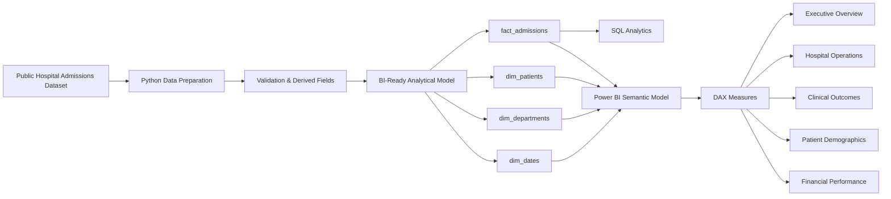

# 🏥 Executive Healthcare Business Intelligence System

## 📊 Hospital Performance Intelligence Dashboard

**Power BI • SQL • Python • DAX**

A production-style healthcare analytics and business intelligence system that transforms public hospital admissions data into a multi-page executive Power BI dashboard for analyzing patient admissions, hospital utilization, clinical outcomes, demographics, and derived financial indicators.

The project demonstrates an end-to-end BI workflow spanning **Python data preparation, dimensional modeling, SQL analytics, DAX measures, data validation, and executive dashboard design**.

---

## 📌 Overview

Healthcare leaders need clear, accessible information to understand patient flow, resource utilization, clinical outcomes, and operational performance.

This project converts a public hospital admissions dataset into a BI-ready analytical system consisting of:

- Python-based data preparation and validation
- Fact and dimension tables for analytical modeling
- SQL-based operational and executive metrics
- DAX measures for the Power BI semantic model
- A multi-page Power BI dashboard
- Executive-focused KPI definitions and documentation
- Automated validation of processed datasets and headline metrics

The result is a portfolio-scale example of how raw healthcare data can be transformed into an executive decision-support system.

---

## 🎯 Business Problem

Hospital administrators often need to answer questions such as:

- How many patients and admissions are being handled?
- Which departments experience the highest patient volume?
- What proportion of admissions are associated with readmission?
- How does length of stay vary across departments and diagnoses?
- What demographic patterns appear in the patient population?
- How do derived treatment-cost indicators vary across the organization?

Answering these questions requires more than visualization alone. The underlying data must first be cleaned, modeled, validated, and translated into consistent business metrics.

This project implements that complete analytical workflow.

---

## ✨ Key Features

### 🐍 Python Data Preparation

The preprocessing pipeline:

- Loads the raw hospital admissions dataset
- Standardizes column names
- Validates required source fields
- Normalizes missing values
- Converts readmission labels into a binary analytical field
- Converts age bands into numeric midpoint values
- Creates reproducible dates for time-intelligence demonstrations
- Derives a treatment-cost proxy from available utilization measures
- Applies basic data-quality guardrails
- Produces BI-ready fact and dimension tables

The primary analytical outputs include:

- `fact_admissions`
- `dim_patients`
- `dim_departments`
- `dim_dates`
- `executive_kpi_table`

### 🧱 Dimensional Data Model

The project organizes processed healthcare data into an analytical model centered on:

```text
fact_admissions
```

with supporting dimensions:

```text
dim_patients
dim_departments
dim_dates
```

This structure supports filtering, aggregation, time intelligence, and reusable executive metrics inside Power BI.

### 🗄️ SQL Analytics

The SQL layer contains dedicated analytical queries for:

- Data-quality checks
- Admissions metrics
- Department performance
- Readmission analysis
- Executive KPI validation

The executive KPI query independently calculates patient counts, admission counts, readmission rate, average length of stay, and derived treatment-cost metrics.

### 📐 DAX Semantic Measures

The Power BI semantic layer includes reusable DAX measures such as:

- Total Patients
- Total Admissions
- Readmission Rate (%)
- Average Length of Stay
- Average Treatment Cost
- Total Treatment Cost
- Department Utilization
- Admissions YTD
- Treatment Cost YTD
- Cost per Patient
- Admissions per Patient

These measures provide consistent business logic across dashboard pages and visuals.

### ✅ Data Validation

A dedicated validation workflow checks that the major processed BI tables exist and contain data.

It also calculates a recruiter-readable verification summary containing:

- Total patients
- Total admissions
- Readmission rate
- Average length of stay
- Average treatment-cost proxy

---

## 🎬 Quick Demo


The animated demo shows the interactive Power BI reporting experience across hospital admissions, operations, clinical outcomes, patient demographics, and derived cost analysis.

The dashboard enables users to:

- Track admissions and patient trends
- Monitor readmission patterns
- Compare department utilization
- Analyze length of stay
- Explore patient demographics and insurance types
- Evaluate derived treatment-cost indicators

---

## 🏗️ System Architecture


```mermaid
flowchart LR

A[Public Hospital Admissions Dataset] --> B[Python Data Preparation]
B --> C[Validation & Derived Fields]
C --> D[BI-Ready Analytical Model]

D --> E[fact_admissions]
D --> F[dim_patients]
D --> G[dim_departments]
D --> H[dim_dates]

E --> I[SQL Analytics]
E --> J[Power BI Semantic Model]
F --> J
G --> J
H --> J

J --> K[DAX Measures]
K --> L[Executive Overview]
K --> M[Hospital Operations]
K --> N[Clinical Outcomes]
K --> O[Patient Demographics]
K --> P[Financial Performance]
```

---

## 📊 Dashboard Pages

### 📈 Executive Overview

High-level hospital performance indicators including patient volume, admissions, readmission patterns, length of stay, and trends.

### 🏨 Hospital Operations

Operational analytics covering department workload, patient flow, utilization, and length of stay.

### 🩺 Clinical Outcomes

Analysis of readmission patterns, diagnoses, and patient outcomes.

### 👥 Patient Demographics

Patient population analysis across age, gender, and insurance categories.

### 💰 Financial Performance

Analysis of **derived treatment-cost indicators** across admissions and departments.

> Treatment-cost values in this project are analytical proxies derived from available utilization variables and do not represent actual hospital billing or accounting records.

---

## 📏 Key Metrics

The executive reporting layer includes:

- Total Patients
- Total Admissions
- Readmission Rate
- Average Length of Stay
- Average Treatment Cost
- Total Treatment Cost
- Department Utilization
- Cost per Patient
- Admissions per Patient

---

## 🧪 Verified Pipeline Output

The complete data-preparation and validation workflow has been executed successfully.

Current verified output:

```text
fact_admissions rows      : 101,766
dim_patients rows         : 71,518
dim_departments rows      : 73
dim_dates rows            : 3,287
executive_kpi_table rows  : 6

Total Patients            : 71,518
Total Admissions          : 101,766
Readmission Rate (%)      : 46.09
Avg Length of Stay        : 4.40
Avg Treatment Cost        : 3474.27
```

The treatment-cost value above is a **derived analytical proxy**, not actual hospital financial data.

---

## ⚠️ Dataset and Analytical Assumptions

This project uses the public **Diabetes 130-US Hospitals for Years 1999–2008** dataset as its source data.

Two important derived fields are used for BI demonstration purposes:

### 📅 Admission Dates

The source dataset does not provide actual admission dates.

The preprocessing pipeline therefore creates a **reproducible synthetic date series** so the Power BI model can demonstrate:

- Monthly trends
- Year-to-date measures
- Date filtering
- Time-intelligence functionality

These dates should not be interpreted as historical admission dates from the source hospitals.

### 💵 Treatment Cost

The source dataset does not contain actual treatment-cost information.

The project therefore creates a **treatment-cost proxy** using available utilization variables such as:

- Laboratory procedures
- Medical procedures
- Medications
- Outpatient visits
- Emergency visits
- Inpatient visits
- Length of stay

These values are intended solely for analytical and dashboard demonstration and should not be interpreted as actual healthcare charges, reimbursements, or accounting records.

### 🔁 Readmission Metric

For this implementation, the source readmission field is converted into a binary analytical variable:

```text
NO           → Not readmitted
Other values → Readmitted
```

The resulting dashboard metric therefore represents the percentage of admission records classified as readmitted by this transformation. It should **not** be interpreted specifically as a 30-day readmission rate.

---

## 🛠️ Technology Stack

| Layer                 | Technology                |
| --------------------- | ------------------------- |
| Business Intelligence | Power BI                  |
| Semantic Metrics      | DAX                       |
| Analytics Queries     | SQL                       |
| Data Preparation      | Python                    |
| Data Transformation   | Pandas / NumPy            |
| Visualization         | Power BI                  |
| Analytical Modeling   | Fact and dimension tables |
| Validation            | Python / SQL              |

---

## 📁 Repository Structure

```text
executive-healthcare-bi-system/
│
├── assets/
│   ├── dashboard_preview.png
│   ├── linkedin_project3_cover.png
│   ├── quick_demo.gif
│   └── quick_demo.mp4
│
├── data/
│   ├── raw/
│   └── processed/
│
├── docs/
│   ├── business_case.md
│   ├── dashboard_walkthrough.md
│   ├── kpi_definitions.md
│   ├── portfolio_summary.md
│   └── stakeholder_questions.md
│
├── notebooks/
│
├── powerbi/
│   ├── dashboard_pages/
│   │   ├── clinical_outcomes.png
│   │   ├── executive_overview.png
│   │   ├── financial_performance.png
│   │   ├── hospital_operations.png
│   │   └── patient_demographics.png
│   ├── data_model.png
│   ├── dax_measures.md
│   └── Healthcare_Executive_Dashboard.pbix
│
├── python/
│   ├── build_date_dimension.py
│   ├── generate_kpis.py
│   ├── prepare_healthcare_data.py
│   └── validation_report.py
│
├── sql/
│   ├── 01_data_quality_checks.sql
│   ├── 02_admissions_metrics.sql
│   ├── 03_department_performance.sql
│   ├── 04_readmission_analysis.sql
│   └── 05_executive_kpis.sql
│
├── LICENSE
├── README.md
└── requirements.txt
```

---

## 🚀 Running the Data Pipeline

Install the required Python packages:

```powershell
pip install -r requirements.txt
```

Prepare the healthcare data:

```powershell
python python\prepare_healthcare_data.py
```

Build the date dimension:

```powershell
python python\build_date_dimension.py
```

Generate the executive KPI table:

```powershell
python python\generate_kpis.py
```

Run the validation report:

```powershell
python python\validation_report.py
```

The resulting processed datasets can then be consumed by the Power BI model.

---

## 💡 Example Executive Questions Answered

The analytical system is designed to help explore questions such as:

- Which departments handle the greatest admission volume?
- What proportion of admission records are classified as readmitted?
- How does length of stay vary by diagnosis or department?
- What demographic groups appear most frequently in admissions?
- Which departments experience the highest workload?
- How do derived treatment-cost indicators vary across departments?
- How do admission patterns change across the synthetic BI timeline?

---

## 🧠 Engineering Decisions

### Separate Data Preparation from Visualization

Data cleaning and transformation are handled in Python rather than embedded entirely inside the dashboard layer.

This keeps data preparation explicit, reproducible, and independently inspectable.

### Use a Dimensional Analytical Model

Fact and dimension tables provide a clearer analytical structure than connecting dashboard visuals directly to the raw source dataset.

### Validate Metrics Outside Power BI

Python and SQL provide independent ways to validate important dashboard metrics rather than relying exclusively on visual output.

### Keep Business Logic Reusable

DAX measures centralize KPI calculations so multiple dashboard visuals can reuse consistent metric definitions.

### Document Derived Data Explicitly

Synthetic dates and treatment-cost proxies are documented as analytical assumptions so demonstration fields are not mistaken for real historical or financial records.

---

## 💼 What This Project Demonstrates

This project demonstrates practical skills relevant to **Data Analytics and Business Intelligence Engineering**, including:

- Translating business questions into measurable KPIs
- Preparing real-world public data for analytics
- Designing fact and dimension tables
- Building reproducible Python transformations
- Writing SQL analytical queries
- Developing reusable DAX measures
- Creating Power BI semantic models
- Designing multi-page executive dashboards
- Validating analytical outputs
- Communicating assumptions and data limitations
- Presenting technical analysis for executive decision support

Together, these components demonstrate how data can move from a raw public dataset through transformation and modeling into a business-facing analytical product.

---

## 👤 Author

**Darrell Mortalla**

AI & Data Science Portfolio Project
